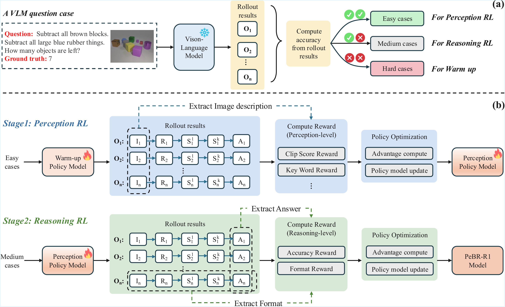

<div align="center">

# Perception Before Reasoning: Two-Stage Reinforcement Learning for Visual Reasoning in Vision-Language Models

[Yan Chen](https://github.com/cythu/PeBR-R1)<sup>1</sup>, 
[Long Li]()<sup>2</sup>, 
[Teng Xi](https://scholar.google.com/citations?hl=zh-CN&user=PN0GRKQAAAAJ&view_op=list_works&sortby=pubdate)<sup>2</sup>, 
[Long Zeng](https://jackyzengl.github.io/)<sup>1✉️</sup>, 
[Jingdong Wang](https://scholar.google.com/citations?hl=zh-CN&user=z5SPCmgAAAAJ)<sup>2</sup>  

<br/>

<sup>1</sup>[Tsinghua University](https://www.tsinghua.edu.cn/en/), 
<sup>2</sup>[Baidu](https://vis.baidu.com/#/)

<sup>✉️</sup>Corresponding Author

</div>


---

## 🔥 News
- **`September 29, 2025.`** We have released the **training code**.
- **`September 28, 2025.`** We have released the [**PeBR-R1 model weights**](https://huggingface.co/cythu/PeBR_R1) and the [**PeBR-R1 dataset**](https://huggingface.co/datasets/cythu/PeBR_R1_dataset) on Hugging Face.  
- **`September 16, 2025.`** Our paper was released on [arXiv](https://arxiv.org/pdf/2509.13031).  
- 🚀 **Coming Next:** We will release the **evaluation code** to support full reproducibility.


Stay tuned ⭐ for training & inference code release!

---

## Abstract
Reinforcement learning (RL) has proven highly effective in eliciting the reasoning capabilities of large language models (LLMs). Inspired by this success, recent studies have explored applying similar techniques to vision-language models (VLMs), aiming to enhance their reasoning performance.  

However, directly transplanting RL methods from LLMs to VLMs is suboptimal, as the tasks faced by VLMs are inherently more complex. Specifically, VLMs must first accurately perceive and understand visual inputs before reasoning can be effectively performed.  

To address this challenge, we propose a **two-stage reinforcement learning framework** designed to jointly enhance both the perceptual and reasoning capabilities of VLMs. To mitigate the *vanishing advantage issue* commonly observed in RL training, we first perform **dataset-level sampling** to selectively strengthen specific capabilities using distinct data sources.  

During training:
- **Stage 1 (Perception RL):** improves the model’s visual perception through coarse- and fine-grained visual understanding.  
- **Stage 2 (Reasoning RL):** targets the enhancement of reasoning abilities.  

After the proposed two-stage reinforcement learning process, we obtain **PeBR-R1**, a vision-language model with significantly enhanced perceptual and reasoning capabilities.  

Experimental results on seven benchmark datasets demonstrate the effectiveness of our approach and validate the superior performance of **PeBR-R1** across diverse visual reasoning tasks.

---
## Framework Overview
<p align="center">

</p>

## Training

### Environment Setup
```bash
conda create -n pebrr1 python==3.10
conda activate pebrr1
git clone https://github.com/cythu/PeBR-R1.git
cd PeBR-R1
pip install -r environment.txt
pip install -e .
```

### Warm-Up Phase
To prepare the dataset for SFT warm-up:
1. Download and filter Mulberry-SFT
Get the [Mulberry-SFT dataset](https://huggingface.co/datasets/HuanjinYao/Mulberry-SFT)
Run the filtering script to remove reflective reasoning samples and any images with width or height smaller than 28 pixels:
```bash
python dataset/filter.py --input dataset/mulberry_sft.json --output dataset/pebr_sft.json --image_root dataset/mulberry_images
```

2. Merge with PeBR-R1 SFT data
Download the [PeBR-R1 sft dataset](https://huggingface.co/datasets/cythu/PeBR_R1_dataset) and merge its images and JSON files with the filtered Mulberry-SFT data.

3. Train with LLaMA-Factory
Register the merged dataset in [LLaMA-Factory](https://github.com/hiyouga/LLaMA-Factory) by updating dataset_info.json.

Example entry:

```json
"pebr_r1_warm_up": {
    "file_name": "./pebr_sft.json",
    "formatting": "sharegpt",
    "columns": {
      "messages": "messages",
      "images": "images"
    },
    "tags": {
      "role_tag": "role",
      "content_tag": "content",
      "user_tag": "user",
      "assistant_tag": "assistant"
    }
  }
```
4.Training configuration
Use the config file provided in `./docs/qwen2_5vl_full_sft.yaml`.

### Reinforcement Learning (RL) Phase
#### Dataset Preparation
Download the [GRPO dataset](https://huggingface.co/datasets/cythu/PeBR_R1_dataset) and place the files into the following locations:  
- Images → `./dataset/grpo/pebr_grpo_images`  
- JSON file → `./dataset/grpo/pebr_grpo_dataset.json`

#### Dataset Sampling
1. Run the sampling script to generate rollout data—each question produces 8 outputs:
```bash
bash examples/pebr_sample.sh
```
2. Split the dataset into easy_case, medium_case, and hard_case based on output accuracy:
```bash
python _rollout_outputs/sample_dataset.py
```

#### Stage 1 RL Training
In this stage, we focus on enhancing the **perception ability** of the VLM. 
1. Start Stage 1 RL training:
```bash
bash examples/pebr_stage1.sh
```

2. Merge the resulting model:
```bash
python scripts/model_merger.py --local_dir checkpoints/easy_r1/stage1_rl/global_step_1/actor
```

#### Stage 2 RL Training
In this stage, we focus on strengthening the **reasoning ability** of the VLM.
1. Start Stage 2 RL training:
```bash
bash examples/pebr_stage2.sh
```
2. Merge the resulting model:
```bash
python scripts/model_merger.py --local_dir checkpoints/easy_r1/stage2_rl/global_step_1/actor
```

---

## Acknowledgements

- **[LLaMA-Factory](https://github.com/hiyouga/LLaMA-Factory)**: We use this framework for SFT warm-up training.  
- **[EasyR1](https://github.com/hiyouga/EasyR1)**: We build our RL training pipeline on top of this project.  
- **[VLMEvalKit](https://github.com/open-compass/VLMEvalKit)**: We adopt this toolkit for evaluating vision-language models.  

We sincerely thank the authors and contributors of these excellent open-source projects for enabling our work.

---
## Citation
If you find **PeBR-R1** useful for your research, please consider citing our work:  

```bibtex
@article{chen2025perception,
  title={Perception Before Reasoning: Two-Stage Reinforcement Learning for Visual Reasoning in Vision-Language Models},
  author={Chen, Yan and Li, Long and Xi, Teng and Zeng, Long and Wang, Jingdong},
  journal={arXiv preprint arXiv:2509.13031},
  year={2025}
}
