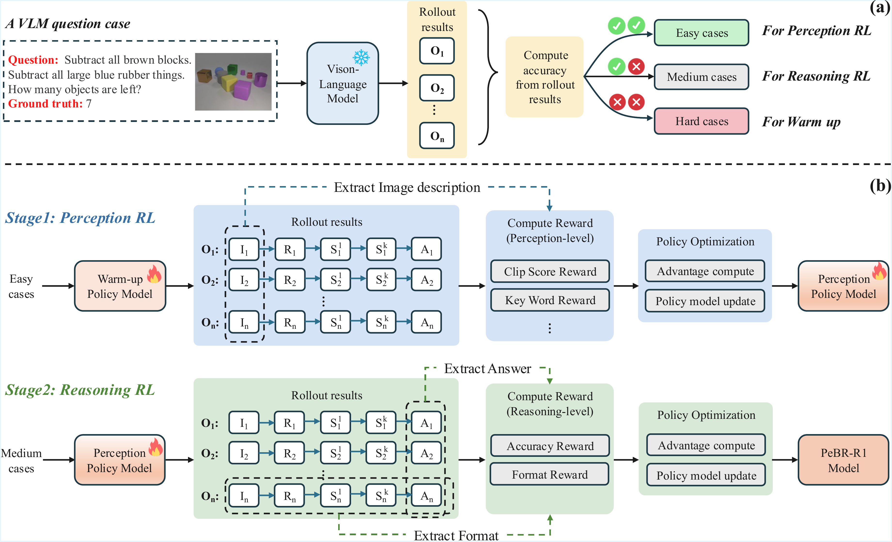

<div align="center">

# Perception Before Reasoning: Two-Stage Reinforcement Learning for Visual Reasoning in Vision-Language Models

[Yan Chen](https://github.com/cythu/PeBR-R1), [Long Li](), [Teng Xi](https://scholar.google.com/citations?hl=zh-CN&user=PN0GRKQAAAAJ&view_op=list_works&sortby=pubdate), [Long Zeng](https://jackyzengl.github.io/)✉, [Jingdong Wang](https://scholar.google.com/citations?hl=zh-CN&user=z5SPCmgAAAAJ) <br/>

<a href='https://arxiv.org/pdf/2509.13031'></a>
<a href='https://huggingface.co/cythu/PeBR_R1'></a>
<a href='https://huggingface.co/datasets/cythu/PeBR_R1_dataset'></a>

</div>

---

## 🔥 News
- **`September 28, 2025.`** We have released the [**PeBR-R1 model weights**](https://huggingface.co/cythu/PeBR_R1) and the [**PeBR-R1 dataset**](https://huggingface.co/datasets/cythu/PeBR_R1_dataset) on Hugging Face.  
- **`September 16, 2025.`** Our paper was released on [arXiv](https://arxiv.org/pdf/2509.13031).
- 🚀 **Coming Next:** We will release the **training code** and **evaluation code** to support full reproducibility.

Stay tuned ⭐ for training & inference code release!

---

## Abstract
Reinforcement learning (RL) has proven highly effective in eliciting the reasoning capabilities of large language models (LLMs). Inspired by this success, recent studies have explored applying similar techniques to vision-language models (VLMs), aiming to enhance their reasoning performance.  

However, directly transplanting RL methods from LLMs to VLMs is suboptimal, as the tasks faced by VLMs are inherently more complex. Specifically, VLMs must first accurately perceive and understand visual inputs before reasoning can be effectively performed.  

To address this challenge, we propose a **two-stage reinforcement learning framework** designed to jointly enhance both the perceptual and reasoning capabilities of VLMs. To mitigate the *vanishing advantage issue* commonly observed in RL training, we first perform **dataset-level sampling** to selectively strengthen specific capabilities using distinct data sources.  

During training:
- **Stage 1 (Perception RL):** improves the model’s visual perception through coarse- and fine-grained visual understanding.  
- **Stage 2 (Reasoning RL):** targets the enhancement of reasoning abilities.  

After the proposed two-stage reinforcement learning process, we obtain **PeBR-R1**, a vision-language model with significantly enhanced perceptual and reasoning capabilities.  

Experimental results on seven benchmark datasets demonstrate the effectiveness of our approach and validate the superior performance of **PeBR-R1** across diverse visual reasoning tasks.

---

## Framework Overview
<p align="center">

</p>

---

## Citation
If you find **PeBR-R1** useful for your research, please consider citing our work:  

```bibtex
@article{chen2025perception,
  title={Perception Before Reasoning: Two-Stage Reinforcement Learning for Visual Reasoning in Vision-Language Models},
  author={Chen, Yan and Li, Long and Xi, Teng and Zeng, Long and Wang, Jingdong},
  journal={arXiv preprint arXiv:2509.13031},
  year={2025}
}
